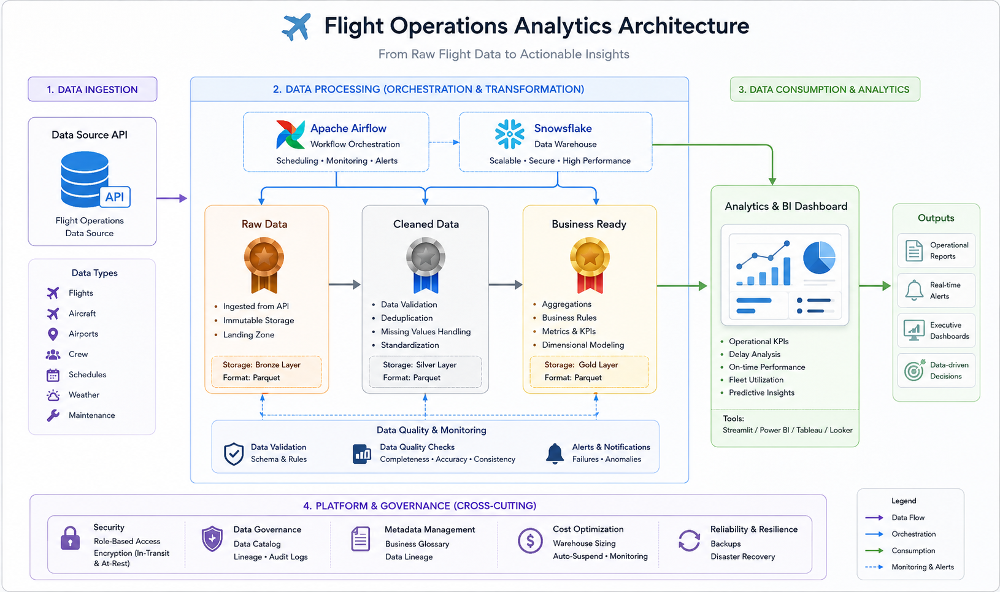

# Flights Operations — Data Engineering Pipeline

A small, production-oriented data engineering project that ingests global flight state data, processes it through bronze → silver → gold stages, and loads aggregated results to Snowflake. Built as an Apache Airflow DAG with standalone Python transformation scripts and a docker-compose for local/dev deployment.



## Key features
- Orchestrated Airflow DAG implementing a 3-tier data lake pipeline (bronze → silver → gold).
- Bronze: fetches raw flight states from the OpenSky API and stores raw JSON.
- Silver: transforms raw JSON to a normalized CSV with selected columns.
- Gold: aggregates silver data (grouping and statistical summaries) and persists a final CSV.
- Optional loader to write gold output into Snowflake using a configured Airflow connection.

---

## Stack
- Language: Python (scripts + Airflow DAG)
- Orchestration: Apache Airflow (DAG in `dags/flight_pipeline.py`)
- Notable libraries: pandas, requests, snowflake-connector-python, python-dotenv
- Runtime: Docker + docker-compose for local Airflow/dev environment

---

## Repository layout
```
.docker-compose.yml         # Docker Compose configuration (local Airflow / services)
System_arc.png              # Architecture diagram
requirements.txt            # Python dependencies (pin as needed)
dags/
  flight_pipeline.py        # Airflow DAG wiring the pipeline tasks
scripts/
  bronze_ingest.py          # Fetches raw states from OpenSky and writes JSON (bronze)
  silver_tranformer.py      # Reads bronze JSON, normalizes and writes CSV (silver)
  gold_aggregate.py         # Reads silver CSV, aggregates into gold CSV
  load_gold_to_snowflake.py # Loads gold CSV into Snowflake (uses Airflow connection)
```

How it fits together:
- The Airflow DAG (`dags/flight_pipeline.py`) schedules the pipeline and calls the scripts/tasks in order:
  1. bronze ingestion → 2. silver transformation → 3. gold aggregation → 4. optional Snowflake load.
- The scripts are implemented as simple Python functions so they can be run by Airflow operators or invoked directly for testing.

---

## Prerequisites
- Docker & Docker Compose (for the provided compose setup)
- Python 3.8+ (for local script invocation / development)
- (Optional) Snowflake account and credentials if you plan to run the Snowflake loader
- Airflow connection: a connection with id `flight_snowflake` (used by `load_gold_to_snowflake.py`) if loading to Snowflake

---

## Quickstart — Local (recommended)
1. Clone the repo
   ```bash
   git clone https://github.com/vikrant-honbute/Flights_Operations_Data_Eng_Project.git
   cd Flights_Operations_Data_Eng_Project
   ```

2. (Optional) Create a Python virtualenv and install dependencies
   ```bash
   python -m venv .venv
   source .venv/bin/activate
   pip install -r requirements.txt
   ```
   Note: `requirements.txt` currently contains minimal entries; add any pinned Airflow/pandas/snowflake packages as needed for your environment.

3. Start services using Docker Compose
   ```bash
   docker-compose up --build -d
   ```
   This compose file is intended to provide a local Airflow environment. After startup, open the Airflow UI to enable and trigger the DAG (`flight_ops_medallion_pipeline` as defined in the DAG file).

4. Configure Snowflake (optional)
   - In Airflow UI: Admin → Connections → create a connection with Conn Id `flight_snowflake` that contains your Snowflake creds (or set the equivalent environment variables in the docker-compose/airflow environment).
   - The Snowflake loader uses `BaseHook.get_connection("flight_snowflake")` to retrieve credentials.

---

## Running the pipeline
Preferred: use Airflow (DAG is in `dags/flight_pipeline.py`).
- Place the repository DAG and scripts into your Airflow's DAGs folder (or mount this repo into your Airflow container via docker-compose).
- Enable the DAG in the Airflow UI and either let it schedule or trigger it manually.

Standalone (for local testing / development)
- You can import and call the functions directly from Python to test each stage:
  ```python
  # from project root
  python - <<'PY'
  from scripts.bronze_ingest import run_bronze_ingestion
  from scripts.silver_tranformer import run_silver_transform
  from scripts.gold_aggregate import run_gold_aggregate
  run_bronze_ingestion()
  run_silver_transform()
  run_gold_aggregate()
  PY
  ```
- Or run small driver scripts that call those functions. When running standalone ensure file paths used by scripts (e.g., `/opt/airflow/data/bronze/...`) exist or adjust the paths to local test directories.

---

## Data sources & locations
- Source API: OpenSky Network states endpoint — the bronze script queries `https://opensky-network.org/api/states/all`.
- Bronze: raw JSON files are written to the pipeline's bronze folder (see script for configured path).
- Silver: normalized CSV(s) are produced with columns such as `icao24`, `callsign`, `origin_country`, `time_position`, `geo_altitude`, `velocity`, etc.
- Gold: aggregated CSV with grouped statistics (average velocity/altitude and record counts) and an optional Snowflake load step.

---

## Configuration & environment
- Docker-compose contains services and environment placeholders used for local testing. Inspect `docker-compose.yml` and update environment variables and mount points as required.
- Snowflake loader expects an Airflow connection named `flight_snowflake`. If you prefer environment variables, modify `load_gold_to_snowflake.py` to read them directly or configure the Airflow connection accordingly.
- If you add secrets or credentials, use `.env` (with `python-dotenv`) or Airflow Secrets backends — never commit credentials to the repository.

---

## Development & testing
- Add unit tests for each script function (e.g., parsing/normalization logic in the silver transformer).
- Run transformations on small samples of OpenSky responses to validate column selections and aggregation logic before running at scale.
- Consider adding CI checks that run the transformation functions on sample fixtures.

---

## TODO / Improvements
- Pin dependencies in `requirements.txt` and include an explicit Airflow version compatible with the DAG code.
- Add robust error handling and retries in scripts (e.g., backoff for API rate limiting).
- Parameterize file paths and make storage backend-agnostic (S3 / GCS support).
- Add schema definitions for silver/gold artifacts and unit tests for data contracts.
- Add logging and structured metrics (task durations, row counts) and surface them to a monitoring backend.

---

## Contributing
Contributions are welcome. Please open issues for bugs/feature requests and submit PRs for improvements. Add tests that demonstrate correctness for new behavior.

---

## License
Specify a license (e.g., MIT) by adding a LICENSE file to this repository.

---

## Questions you might want to ask next
- Which columns and data types should the gold table use in Snowflake (and what primary keys/merge keys do we want)?
- Do you want persistent storage in cloud object storage (S3/GCS) instead of local filesystem paths used by the scripts?
- Should the pipeline include enrichment steps (e.g., reverse-geocoding coordinates, mapping to airports, or joining with schedules/airline metadata)?
